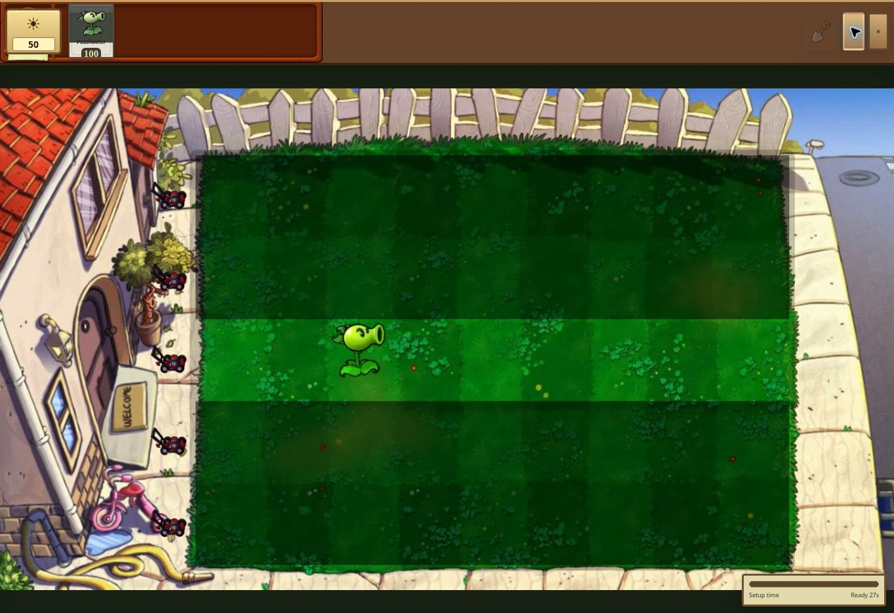

# PVZ Adventure v12 verification

Run the production simulation and Canvas renderer regression suite:

```sh
npm install --no-save @napi-rs/canvas
node tests/pvz-regression.cjs
```

Set `PVZ_QA_DIR` to also save a rendered Day lawn screenshot.

The suite executes the inline production JavaScript with a deterministic random
seed. Native Canvas performs real image decoding and rendering; DOM, audio and
browser scheduling are substituted for the test environment.

The 28 checks cover all 50 level configurations and startup renders, all 49 plant
and 25 zombie artwork mappings, a normal-resource 1-1 win, targeting, armor,
lobbed splash, homing shots, sleeping mushrooms, mines, two-cell Cob Cannons,
simulation-time queues, pause/restart, bowling, wave completion, resource
collection, terrain restrictions and Endless Day/Night transitions.

The live GitHub Pages build was also checked in Chrome: the v12 marker, seed
selection, starting Adventure 1-1, dragging a Peashooter onto the lawn, pause,
and the PocketVM first-time setup screen all worked.



The automated suite is not a browser interaction test or a complete
playthrough of all 50 levels. Boss phase choreography, exact wave rosters,
animation timing, every special zombie interaction and full original-game
balance still need comparative playtesting.

## Update delivery

The package marker and Store revision are `adventure-v12`. Store download size
comes from the final UTF-8 game file size. Shell cache `pocketvm-shell-v71`
refreshes the hosted engine; an installed game migrates when it next opens.
Existing game saves, unlocks and imported music files are retained.
